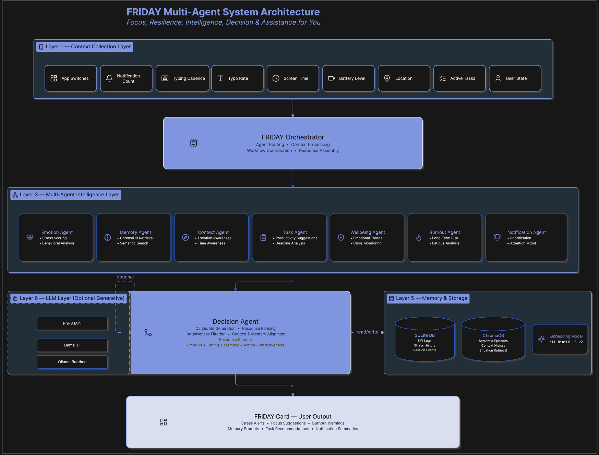
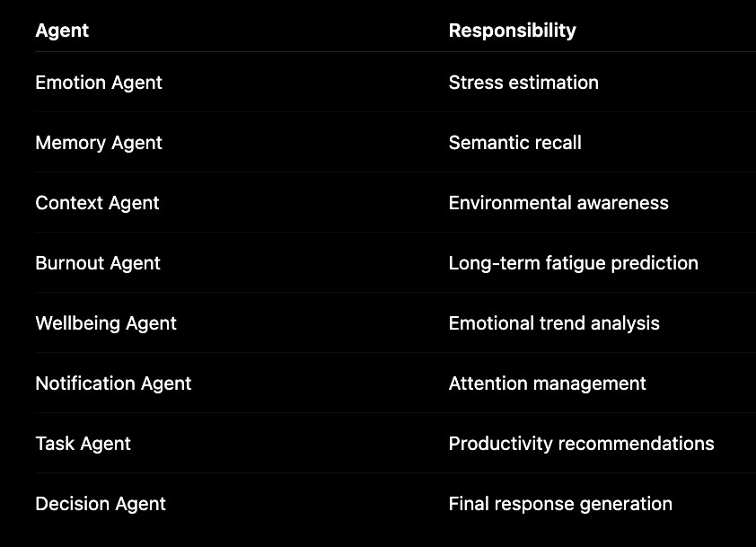
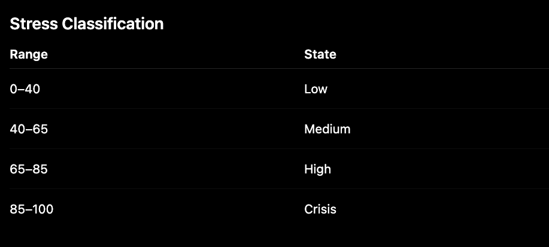
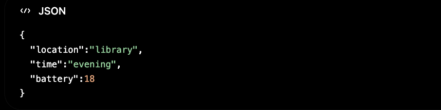
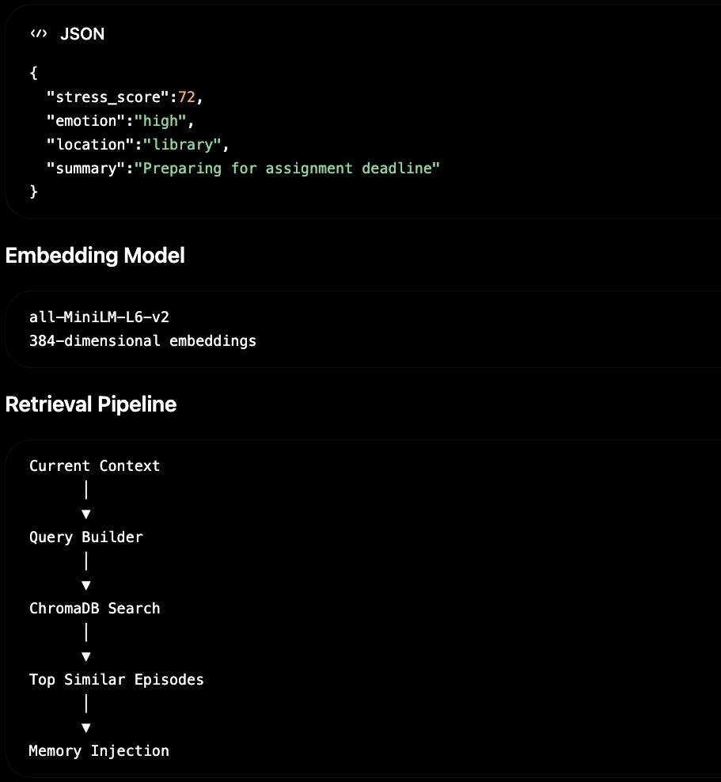
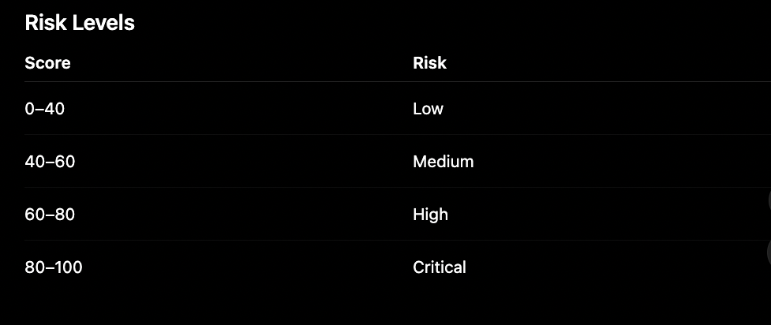
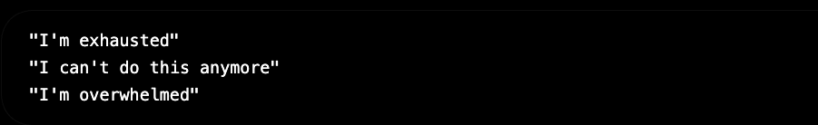
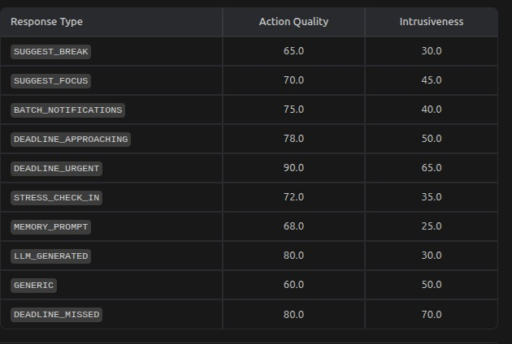

# FRIDAY Technical Documentation
## 1. Project Overview
FRIDAY (Focus, Resilience, Intelligence, Decision & Assistance for You) is a privacy-first multi-agent AI wellbeing assistant designed to help users manage cognitive overload, stress, and burnout. Unlike traditional assistants that rely solely on user commands, FRIDAY continuously analyzes behavioral and contextual signals such as notification activity, app switching patterns, screen usage, and historical interactions to provide proactive, context-aware support.

The system combines specialized AI agents for emotion analysis, memory retrieval, context understanding, burnout prediction, and decision-making. By leveraging local memory storage, on-device reasoning, and adaptive response scoring, FRIDAY delivers personalized interventions while maintaining user privacy and minimizing unnecessary interruptions.

## 2.System Architecture

## 3.Core Technical Innovation
Instead of relying on a single LLM prompt, FRIDAY decomposes reasoning into specialized agents.

## 4.Emotion Detection Engine

The Emotion Agent estimates a real-time stress score using behavioral signals collected from the device.

### Inputs are taken from :
1. App Switching Frequency
2. Notification Volume
3. Typing Cadence
4. Typographical Error Rate
5. Screen-On Duration
6. On-Device Stress Model Output

### Weighted Stress Formula:
Stress Score =0.20 × App Switches +0.20 × Notifications +0.20 × Typo Rate +0.15 × Typing Cadence +0.15 × Screen Time +0.10 × On-Device Model

## 5.Context Awareness Engine
The Context Agent enriches raw sensor information.

### Context Signals:
1. Location
2. Time of Day
3. Battery Status
4. Charging State
5. Device Usage Pattern

## 6. Semantic Memory System
### Long-Term Memory Architecture

FRIDAY stores significant user episodes in a local ChromaDB vector database.

This allows FRIDAY to remember similar past situations and adapt recommendations accordingly.

## 7. Burnout Prediction Framework

The Burnout Agent predicts long-term fatigue risk.

### Inputs:
1. Historical Stress Logs
2. Screen Usage
3. Notification Load
4. App Switching Frequency (via `UsageStatsManager`)
5. Recovery Indicators

### Formula:
Burnout Score =0.40 × Sustained Stress+0.35 × Workload+0.15 × Social Pressure+0.10 × Recovery

## 8. Wellbeing Monitoring

The Wellbeing Agent performs longitudinal emotional analysis.

1. Detection Capabilities
2. Sustained High Stress
3. Self-Critical Language
4. Burnout Signals
5. Crisis Indicators

## 9. Decision Intelligence Layer

The Decision Agent is responsible for choosing the most useful intervention.

### Candidate responses are collected from:

1. Task Agent
2. Emotion Agent
3. Memory Agent
4. Notification Agent
5. LLM Generator
6. Candidate Evaluation

Each candidate is scored using:

### Formula:
Response Score = (E × 0.30) + (T × 0.25) + (M × 0.20) + (Q × 0.10) + (P × 0.15)

Where E = Emotional Relevance, T = Timing Context, M = Memory Alignment, Q = Action Quality, P = 100 − Intrusiveness. Weights are adjusted via RLHF and renormalized every 10 interactions.

## 10. Privacy & Security

FRIDAY is designed around privacy-first principles.

Local Components:

1. SQLite Database
2. ChromaDB Memory Store
3. Stress Detection Engine
4. Decision Engine

Privacy Features:

1. No cloud storage of personal data
2. Local memory retrieval
3. Offline operation
4. Device-side behavioral analysis
5. AccessibilityService uses ViewID-only lookups (browser URL bars, YouTube titles) — no recursive UI tree traversal
6. App usage tracked via system `UsageStatsManager` API
7. Thread-safe backend state with `asyncio.Lock()` guarded `ConnectionManager`

## 11. Performance Metrics

## 12.AI Models & Datasets
Burnout Prediction Model 
Base Architecture: RoBERTa + LoRA Fine-Tuning 
Purpose: Burnout risk classification and wellbeing signal detection 
Model: https://huggingface.co/Rabbit-bot/FRIDAY-roberta-burnout-lora 
Training Dataset: https://huggingface.co/datasets/Rabbit-bot/burnout-telemetry 

## 13.On-Device AI Infrastructure
FRIDAY uses an on-device language model for offline reasoning and response generation. 

Model: https://huggingface.co/microsoft/Phi-3-mini-4k-instruct-onnx

## 14.Voice Processing Pipeline
Speech-to-Text Engine 
Voice interactions are processed locally using Whisper.cpp. 
Framework: https://github.com/ggml-org/whisper.cpp

## 15. Gemma 4 Integration

FRIDAY uses **Google Gemma 4 E4B** as the primary LLM backbone, running locally via Ollama.

### Why Gemma 4 E4B

1. Open-weight model (Apache 2.0) — full transparency and reproducibility
2. Edge-optimized — runs on consumer laptops with INT4 quantization (~5 GB VRAM)
3. 256K context window — handles complex multi-session workspace context
4. Multimodal capable — future-proofed for image and audio signal integration
5. Model-agnostic slot — swappable via a single Ollama configuration string

### Future Enhancements

Future versions can leverage Gemma 4's multimodal capabilities to analyze:

1. Visual workspace context (screen layout, tab arrangement)
2. Wearable device physiological signals (HRV, sleep quality)
3. Audio environment classification for context-aware intervention
4. Cross-modal burnout signal fusion

